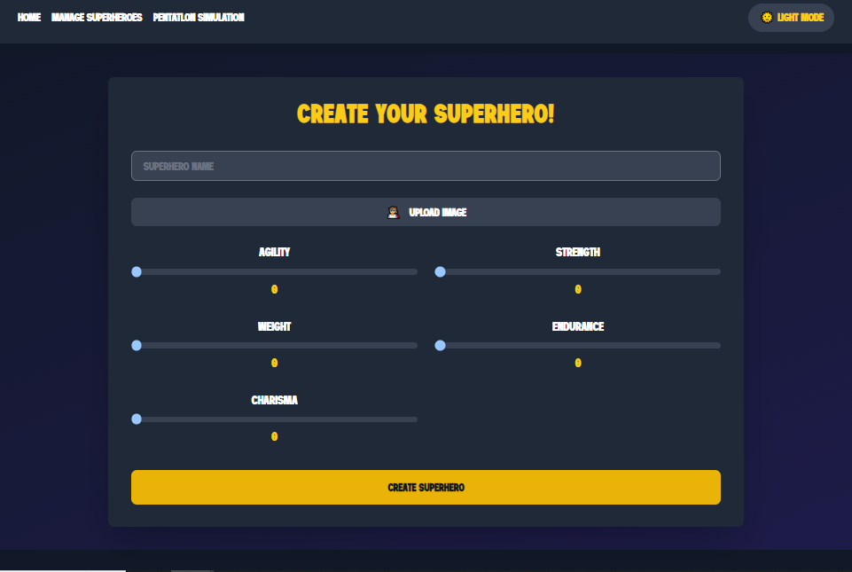
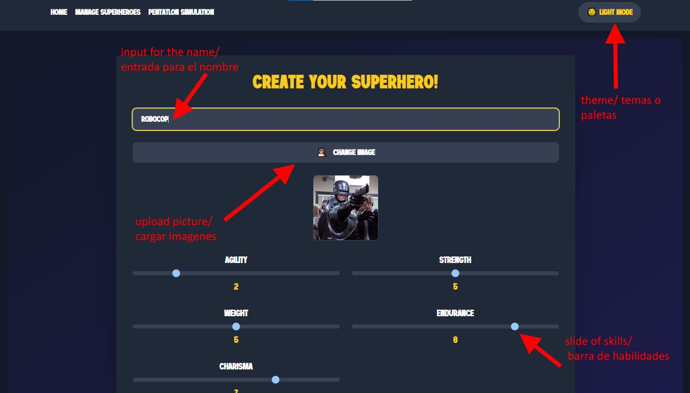

#  Pentatlón de Superhéroes! 🦸🦹‍♂️


#  Descripcion/About :page_with_curl: 


<details>
  <summary markdown="span"><strong>:spain: Español</strong></summary><br />
Desarrollé el pentatlón de superhéroes en Vue.js utilizando TypeScript y Tailwind. Implementé un formulario para crear héroes y asignarles puntos en habilidades específicas. En una vista adicional, se muestran todos los héroes creados, y en la última vista, diseñé un simulador que permite seleccionar tres héroes y ver quién queda en primer lugar después de los desafíos presentados en la consigna. Además, añadí una tabla que muestra el ranking individual de cada héroe en cada desafío.
<br />
</details>

<details>
  <summary markdown="span"><strong>:us: English</strong></summary><br />
  
I developed a superhero pentathlon in Vue.js using TypeScript and Tailwind. I implemented a form to create heroes and assign them points in specific skills. In an additional view, all created heroes are displayed, and in the final view, I designed a simulator that allows selecting three heroes and seeing who finishes in first place after the challenges presented in the prompt. Additionally, I added a table that shows each hero's individual ranking in each challenge.
<br />
</details>

# Click on the thumbnail to see the walkthrough/ Clic aquí para ver la demostración!▶️
[](https://www.youtube.com/watch?v=cfR62MX-j8w&ab_channel=Juani)


# Installation/Instalación ⚙️
</details>
 
1) 
```
npm install
```

2)
```
npm run dev
```

# Technologies Used :hammer_and_wrench:
</details>
 

- Vue
- TypeScript
- JavaScript
- HTML
- CSS
- Tailwind




